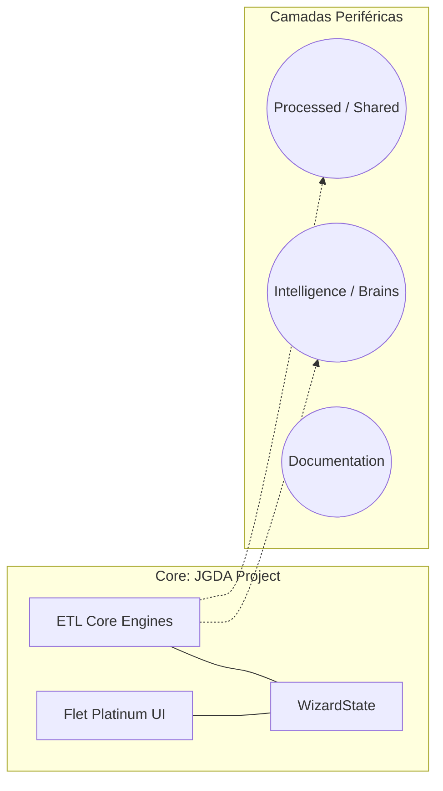
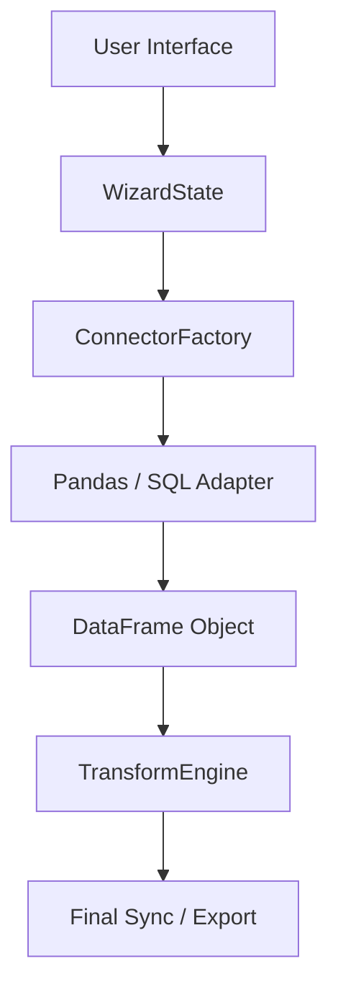

# Genaja Engineering Baseline — v0.7.2 Stable

Este documento estabelece as diretrizes arquiteturais e os limites de segurança para desenvolvedores e agentes de IA que atuam no ecossistema Genaja.

## Topologia de Sistemas

O projeto é dividido em um Motor de Processamento Técnico (`JGDA`) e camadas periféricas de Inteligência e Armazenamento.

---

## Estrutura de Camadas (Data Flow)

O fluxo de dados segue o princípio de desacoplamento rigoroso. A Interface não possui conhecimento sobre a origem ou a transformação física dos dados.

---

## Modelo de Segurança e Blindagem (LGPD)

A integridade dos dados e da inteligência de mercado é protegida por barreiras de infraestrutura local.

```mermaid
graph LR
    subgraph "Repositório de Código (Git Scope)"
        Src[Source Code]
        Config[Public Configs]
    end

    subgraph "Zonas de Exclusão (Local Boundary)"
        Intel[Intelligence / Learning]
        Data[Client Data / Results]
        Audit[Audit Traces]
    end

    Src -.-> |Lê/Escreve| Intel
    Src -.-> |Gera| Data
    
    %% Barreira Física (.gitignore)
    Barrier{{.gitignore Master}}
    Barrier --- Intel
    Barrier --- Data
    Barrier --- Audit
    
    style Intel fill:#2b0000,stroke:#ff0000
    style Data fill:#2b0000,stroke:#ff0000
    style Barrier fill:#000,stroke:#fff,stroke-width:2px
```

## Arquitetura de Inteligência Cognitiva
O Genaja implementa uma camada de assistência heurística desacoplada para garantir máxima fidelidade na sincronização de fontes heterogêneas.

* **Heuristic Resolution Engine**: Algoritmos de inferência baseados em distância de Levenshtein para mapeamento automático de alta precisão.
* **Cognitive Intelligence Core**: Núcleo de aprendizado local que cataloga padrões estruturais, permitindo a aceleração exponencial de rotinas recorrentes.
* **Isolated Data Periphery**: Arquitetura orientada à privacidade (LGPD), onde todo o processamento e inteligência são mantidos estritamente em ambiente local (`Local-Only`).

---
*Atualizado: v0.7.2 — 10/04/2026*
