# Genaja — Universal Data Synchronization Engine

[🇺🇸 View in English](README.en.md) | [🇧🇷 Visualizar em Português](README.md)

> **Current Version:** `v0.7.1` (Stable Governance)
> **Status:** Production Ready — Python / Flet / Rust-Hybrid

---

## Processing Flow (High-Level)

```mermaid
graph TD
    subgraph "Ingestion Layer"
        A[Source: Excel / SQL] --> B[ConnectorRegistry]
        B --> C[WizardState]
    end

    subgraph "Transformation Engine (JGDA)"
        C --> D[TransformEngine]
        D --> E[Lookup / Sync]
        E --> F[Validation]
    end

    subgraph "Data Delivery"
        F --> G[Output: XLSX / SQL]
        G --> H[Audit Tracker]
    end

    style D fill:#1a1a1a,stroke:#00ff00,stroke-width:2px
    style E fill:#1a1a1a,stroke:#00ff00,stroke-width:2px
```



## Cognitive Intelligence Architecture
Genaja implements a decoupled heuristic assistance layer to ensure maximum fidelity when synchronizing heterogeneous data sources.

* **Heuristic Resolution Engine**: Inference algorithms based on Levenshtein distance for high-precision automated mapping.
* **Cognitive Intelligence Core**: Local learning core that catalogs structural patterns, enabling exponential acceleration of recurrent routines.
* **Isolated Data Periphery**: Privacy-oriented architecture (GDPR/LGPD ready), where all processing and intelligence are strictly maintained in a local environment (`Local-Only`).

---

## Quick Start (Execution Environment)

To initialize the application in stable mode:

```bash

### v0.6.1 — Alpha v2 Stabilization (2026-03-26)

- Migration to `PlatinumTheme`: dynamic color and contrast tokens
- Automatic luminance calculation for `ThemeMode` adjustment
- Release audit: removal of private documents before publication

---

### Earlier Versions

**v0.6.0** — Flet migration (Python Flutter). Functional parity with v0.4.x series. Comparator module and Dual-List Transfer restored.

**v0.5.9** — History synchronization and pre-commit hook certification.

**v0.5.8** — Global settings panel (Trim/Case, export, security).

**v0.5.6** — Phoenix Customizer 2.0: theme editor with real-time preview.

**v0.5.5** — Stabilization after Tkinter removal.

**v0.5.4** — Complete removal of Tkinter support. Pure PySide6 application.

**v0.5.3** — Custom Title Bar (VS Code style), visual theme engine.

**v0.5.2** — Heuristic mapping engine fixes.

**v0.5.1** — Double window initialization bug fix.

**v0.5.0** — PySide6/Tkinter hybrid architecture, 4-step Wizard, real-time dashboard.

**v0.4.9** — Live Theme Customizer.

**v0.4.7** — Floating tooltips, global scroll, experimental Big Data support (JSON, CSV, SQL).

**v0.4.6** — Single Hub with Protected A1 Key via checkbox.

**v0.4.3** — Dual-layer documentation (Analyst / IT) with bilingual parity.

**v0.4.0** — Intelligent cross-filter and native transfer selections.

**v0.3.5** — Full refactor into decoupled architecture.

---

*Detailed technical documentation available in `docs/`.*
