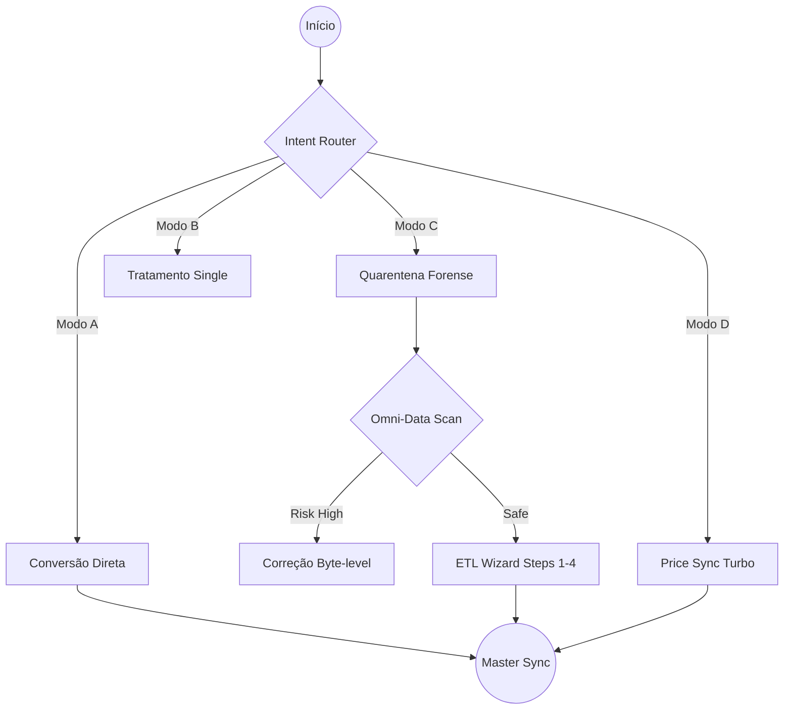

# GENAJA SUITE — Elite Data Intelligence & Forensics

[🇺🇸 English](README.en.md) | [🇧🇷 Português](README.md)

> **Versão Atual:** `v0.7.2` (Stable Governance Platinum)
> **Engine:** Omni-Data Hybrid (Python/Rust)

---

## 🛡️ O Ecossistema de Inteligência Forense

O **Genaja Suite** não é apenas um motor de ETL; é uma plataforma de **Engenharia de Interoperabilidade Cognitiva** projetada para saneamento massivo de dados heterogêneos com 100% de privacidade local (No-Cloud).

### 1. Fluxo de Intencionalidade (Adaptive Routing)
O sistema utiliza um roteador de intenções que adapta a jornada do dado baseado na complexidade da tarefa:

### 2. Pipeline de Processamento Cognitivo
Abaixo, a arquitetura de como o **Motor JGDA** interage com o **Cérebro Genaja**:

```mermaid
graph LR
    subgraph "Engrenagem (The Motor)"
        AD[Adapters] --> RD[Rust Engine]
        RD --> PL[Profiling Layer]
    end

    subgraph "Inteligência (The Brain)"
        PL --> MS[Mega-Store]
        MS --> CS[Curated Rules]
    end

    subgraph "Saída (Output)"
        CS --> EX[Export Service]
        EX --> AU[Audit LGPD]
    end

    style RD fill:#0a0a0a,stroke:#00ffff,stroke-width:2px
    style MS fill:#0a0a0a,stroke:#amber,stroke-width:2px
```

---

## 🛠️ Estágios do Wizard (The Elite Path)

O Wizard de 4 estágios garante que dados de fontes "sujas" ou não-estruturadas sejam domesticados com precisão determinística:

1.  **🔍 Inspeção (Step 0)**: Varredura binária (Magic Bytes) via Omni-Data para detectar fraudes de extensão (ex: SAP XML mascarado como XLS).
2.  **🔗 Conectividade (Step 1)**: Mapeamento de fontes locais ou SQL com descoberta automática de schema.
3.  **🧬 Sincronia de Chaves (Step 2)**: Intersecção de datasets para identificação de Primary Keys com 99% de confiança.
4.  **🧩 Mapeamento Atributivo (Step 3)**: Inferência fuzzy (Levenshtein) para colunas com nomes divergentes.
5.  **⚡ Execução & Auditoria (Step 4)**: Processamento massivo com log de auditoria retroativo (Conformidade Art. 37 LGPD).

---

## 🚦 Diferenciais Platinum
- **Zero Data Leak**: Blindagem nativa via Protocolo de Governança (bloqueio total de caminhos `brains/` e `docs/`).
- **Omni-Data Engine**: Inspeção híbrida Python/Rust para performance de baixa latência em arquivos XL de grande volume.
- **Cognitive Cache**: O sistema aprende com cada mapeamento feito pelo operador, reduzindo o tempo de trabalho em 80% em execuções recorrentes.

---

*Documentação Técnica Detalhada em `docs/ARCHITECTURE.md`*
