# Genaja — Universal Data Synchronization Engine

[🇺🇸 View in English](README.en.md) | [🇧🇷 Visualizar em Português](README.md)

> **Versão Atual:** `v0.7.1` (Stable Governance)
> **Status:** Production Ready — Python 3.12+ / Flet / Rust-Hybrid
> **Licença:** Enterprise Proprietary / Internal Use

---

## 🛠️ Pilha Tecnológica (Elite Stack)

O Genaja é construído sobre uma base tecnológica de alta performance e desacoplamento:

| Componente | Tecnologia | Papel |
| :--- | :--- | :--- |
| **Core Engine** | Python 3.12 + Pandas 3.0 | Processamento massivo e lógica ETL |
| **High-Speed Engine** | Rust (Omni-Data) | Inspeção binária e conversão ultra-rápida |
| **Interface (UI)** | Flet (Flutter) | Experiência nativa multiplataforma (Desktop/Web) |
| **Conectividade** | SQLAlchemy 2.0 | Interface universal para SQL (Postgres, MySQL, etc.) |
| **Inteligência** | Custom Heuristics | Inferência probabilística local (Levenshtein/Fuzzy) |

## Fluxo de Processamento (High-Level)

```mermaid
graph TD
    subgraph "Camada de Ingestão"
        A[Fonte: Excel / SQL] --> B[ConnectorRegistry]
        B --> C[WizardState]
    end

    subgraph "Motor de Transformação (JGDA)"
        C --> D[TransformEngine]
        D --> E[Lookup / Sync]
        E --> F[Validation]
    end

    subgraph "Entrega de Dados"
        F --> G[Saída: XLSX / SQL]
        G --> H[Audit Tracker]
    end

    style D fill:#1a1a1a,stroke:#00ff00,stroke-width:2px
    style E fill:#1a1a1a,stroke:#00ff00,stroke-width:2px
```



## Arquitetura de Inteligência
O Genaja utiliza uma camada de inteligência desacoplada para garantir precisão no mapeamento de dados heterogêneos.

* **Heurística Probabilística**: Sugestões baseadas em distância de Levenshtein (Fuzzy Matching).
* **Cérebro de Aprendizado**: Persistência local de padrões de dados para aceleração de mapeamentos futuros.
* **Privacidade Local**: O aprendizado da IA é mantido estritamente em ambiente local (`brains/`), fora do escopo de versionamento.

---

## Quick Start (Ambiente de Execução)

Para inicializar a aplicação em modo estável:

```bash
# Instalar dependências
pip install -r requirements.txt

# Executar motor principal
python src/main.py
```

---

## Governança v0.7.1 (Standard Rules)

O projeto segue regras estritas de versionamento e segurança corporativa:
* **Version Hook**: Registro obrigatório de auditoria para cada alteração de versão.
* **Privacy Boundary**: `.gitignore` mestre bloqueia vazamento de dados sensíveis ou aprendizado de mercado.
* **Code Purity**: Ausência de lógica de negócio em camadas de interface; total desacoplamento via `Engine Facade`.
* **Universal SQL**: Suporte nativo a conectores relacionais com descoberta dinâmica de esquema.

---

## 🚦 Roadmap & Certificação

O sistema v0.7.1 é certificado para operações de saneamento de dados de alta complexidade em ambientes corporativos que exigem conformidade rigorosa com a LGPD e auditabilidade total.

## Histórico de Evolução (Destaques)

### v0.7.1 — Governança e Estabilização (09/04/2026)
* **Centralização de Versão**: Implementação do `version_hook.py`.
* **Segurança LGPD**: Novo `.gitignore` mestre protegendo a pasta `brains/` e `shared/`.
* **Fixes Críticos**: Estabilização do motor de detecção de duplicidade e correção de inicialização Flet.

### v0.7.0 — Conectores Universais (02/04/2026)

*Documentação técnica detalhada disponível em `docs/`.*
