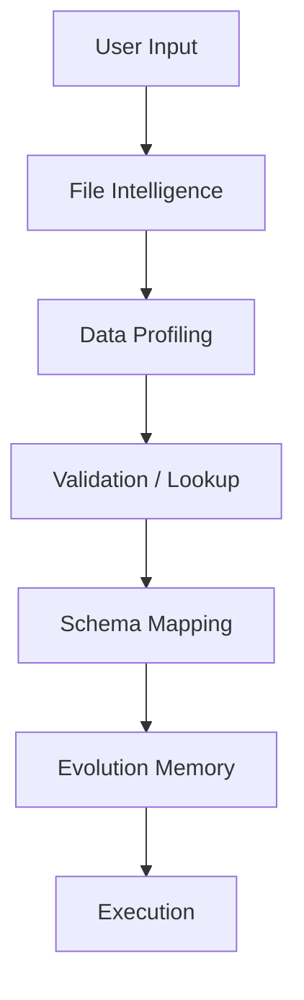

# Architecture: Genaja Learning Layer

Visualização do fluxo de inteligência evolutiva (v0.6.7).

## Camadas de Inteligência (v0.6.7)

1. **User Input / Multi-Sheet**: Carregamento de arquivos e seleção de abas (v0.6.6).
2. **File Intelligence**: Pré-análise de integridade estrutural.
3. **Data Profiling (v0.6.5)**: Deep-dive no conteúdo (`dtype`, unicidade, comprimento). Reduz falsos positivos via análise estatística.
4. **Validation / Lookup**: Auditoria de nulos e match exato de colunas.
5. **Schema Mapping**: Similaridade fuzzy (Levenshtein) para colunas desconhecidas.
6. **Evolution Memory (v0.6.7)**: Recuperação de mapeamentos históricos baseada em 12k+ associações estatísticas.
7. **Execution**: Sincronização final e registro de novo aprendizado.
