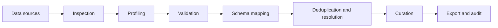
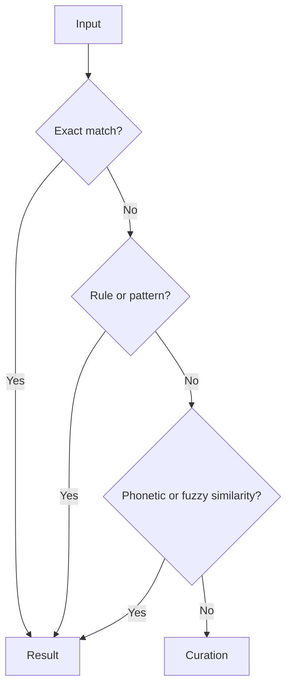

# Genaja

[English](README.en.md) | [Português](README.md)

Genaja is a local prototype for inspecting, transforming, mapping and consolidating heterogeneous data.

The project explores workflows related to ETL, data migration, data quality and entity resolution while keeping local processing as an architectural principle.

## Current status

Documented version: `v0.7.3`

The repository contains Python and Rust components, technical documentation, validation routines, schema mapping and deduplication mechanisms.

This project should be treated as an engineering prototype and laboratory, not as a validated production product.

## Capabilities visible in the codebase

* data inspection and profiling
* value and structure validation
* schema discovery and mapping
* fuzzy similarity using Levenshtein distance
* phonetic comparison in deduplication routines
* exact matching and resolution heuristics
* record consolidation and selection
* local processing
* logging and audit trails
* SQL source integration in parts of the workflow

## Conceptual architecture

## Record resolution

The project combines deterministic and heuristic signals.

## Technical structure

Detailed documentation is available at:

`JGDA/docs/ARCHITECTURE.md`

Relevant components include:

`JGDA/src/migration/schema_mapper.py`

`JGDA/src/core/engines/deduplication_engine.py`

`CHANGELOG.md`

## Project goal

Genaja explores techniques for making data migration and cleanup more traceable and reproducible, especially when different sources use inconsistent schemas, names and formats.

## Status

Experimental development.

Performance, accuracy or percentage improvement claims should only be considered after reproducible benchmarks are published.
