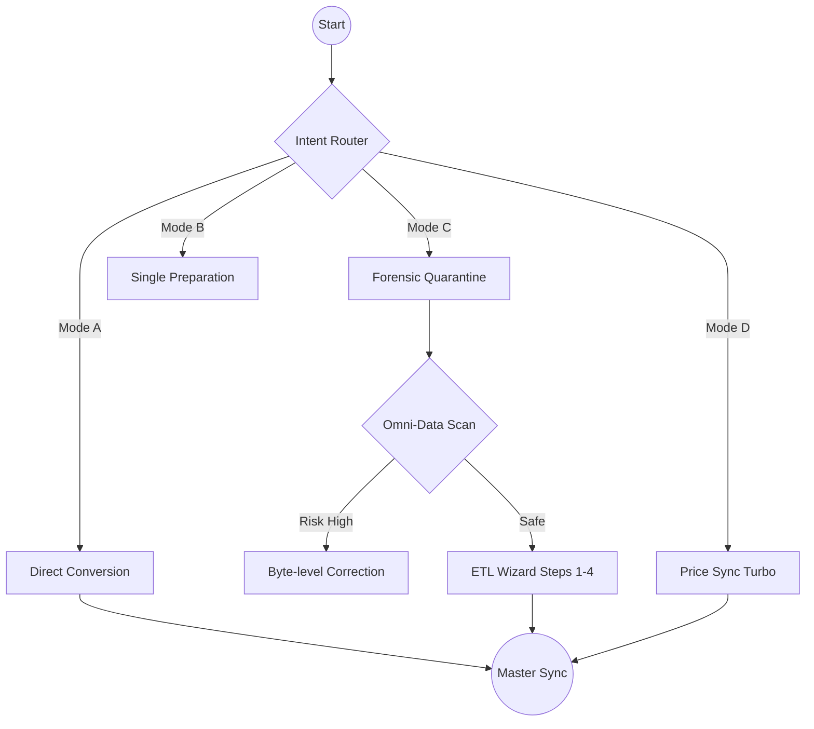
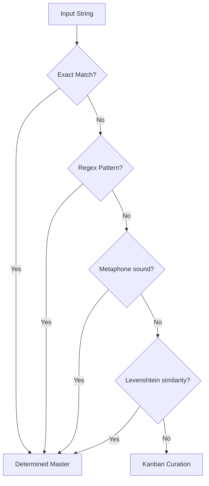
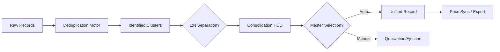

# GENAJA SUITE / Elite Data Intelligence & Forensics

[🇺🇸 English](README.en.md) | [🇧🇷 Português](README.md)

> **Current Version:** `v0.7.3` (Genaja JGDA)
> **Engine:** Omni-Data Hybrid (Python/Rust)

---

## 🛡️ The Forensic Intelligence Ecosystem

**Genaja Suite** is more than an ETL engine; it is a **Cognitive Interoperability Engineering** platform designed for massive sanitation of heterogeneous data with 100% local privacy (No-Cloud).

### 1. Adaptive Intent Flow
The system utilizes an intent-driven router that adapts the data journey based on task complexity:

### 2. Cognitive Processing Pipeline
Below is the architecture showing how the **JGDA Engine** interacts with the **Genaja Brain**:

```mermaid
graph LR
    subgraph "The Motor"
        AD[Adapters] --> RD[Rust Engine]
        RD --> PL[Profiling Layer]
    end

    subgraph "The Brain"
        PL --> MS[Mega-Store]
        MS --> CS[Curated Rules]
    end

    subgraph "Output Layer"
        CS --> EX[Export Service]
        EX --> AU[Audit LGPD]
    end

    style RD fill:#0a0a0a,stroke:#00ffff,stroke-width:2px
    style MS fill:#0a0a0a,stroke:#amber,stroke-width:2px
```

### 3. Cognitive Decision Hierarchy (The Brain)
The MDM engine processes data through confidence layers, prioritizing deterministic signals:

### 4. Consolidation HUD Lifecycle (Data 1:N)
Visualizing the flow for handling duplicate records and Master selection:

---

## 🛠️ Wizard Stages (The Elite Path)

The 4-stage wizard ensures that data from "dirty" or unstructured sources is tamed with deterministic precision:

1.  **🔍 Inspection (Step 0)**: Binary scanning (Magic Bytes) via Omni-Data to detect extension fraud (e.g., SAP XML masked as XLS).
2.  **🔗 Connectivity (Step 1)**: Local or SQL source mapping with automatic schema discovery.
3.  **🧬 Key Synchronization (Step 2)**: Dataset intersection for primary key identification with 99% confidence.
4.  **🧩 Attributive Mapping (Step 3)**: Fuzzy inference (Levenshtein) for columns with divergent naming.
5.  **⚡ Execution & Audit (Step 4)**: Massive processing with retroactive audit logs (Compliance with LGPD Art. 37).

---

## 🚦 Platinum Differentials
- **Zero Data Leak**: Native shielding via Governance Protocol (total lockdown of `brains/` and `docs/` paths).
- **Omni-Data Engine**: Hybrid Python/Rust inspection for low-latency performance on high-volume XL files.
- **Cognitive Cache**: The system learns from every mapping performed by the operator, reducing work time by 80% on recurring tasks.

---

*Detailed Technical Documentation in `docs/ARCHITECTURE.md`*
