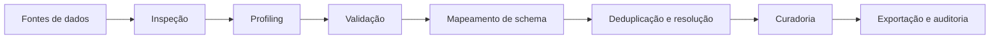
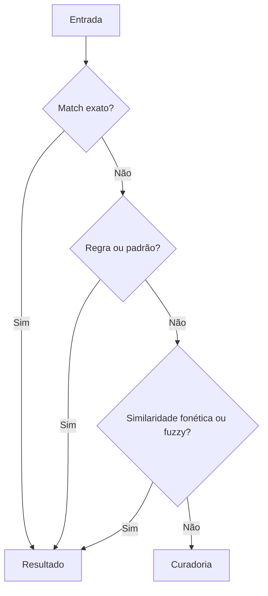

# Genaja

[English](README.en.md) | [Português](README.md)

Genaja é um protótipo local para inspeção, transformação, mapeamento e consolidação de dados heterogêneos.

O projeto explora um fluxo de trabalho voltado a ETL, migração de dados, qualidade de dados e resolução de entidades, mantendo o processamento local como princípio de arquitetura.

## Estado atual

Versão documentada: `v0.7.3`

O repositório contém componentes em Python e Rust, além de documentação técnica, mecanismos de validação, mapeamento de schema e deduplicação.

Este projeto deve ser tratado como protótipo e laboratório de engenharia, não como produto de produção validado.

## Capacidades presentes no código

* inspeção e profiling de dados
* validação de valores e estruturas
* descoberta e mapeamento de schema
* similaridade fuzzy com distância de Levenshtein
* comparação fonética em rotinas de deduplicação
* exact matching e heurísticas de resolução
* consolidação e seleção de registros
* processamento local
* geração de logs e trilhas de auditoria
* integração com fontes SQL em componentes do fluxo

## Arquitetura conceitual

## Resolução de registros

O projeto combina sinais determinísticos e heurísticos.

## Estrutura técnica

A documentação detalhada está em:

`JGDA/docs/ARCHITECTURE.md`

Alguns componentes relevantes:

`JGDA/src/migration/schema_mapper.py`

`JGDA/src/core/engines/deduplication_engine.py`

`CHANGELOG.md`

## Objetivo do projeto

O objetivo do Genaja é estudar e implementar técnicas para tornar migrações e saneamento de dados mais rastreáveis e reproduzíveis, especialmente quando diferentes fontes usam schemas, nomes e formatos inconsistentes.

## Status

Em desenvolvimento experimental.

Claims de desempenho, precisão ou ganho percentual só devem ser considerados após benchmarks reproduzíveis e publicados.
