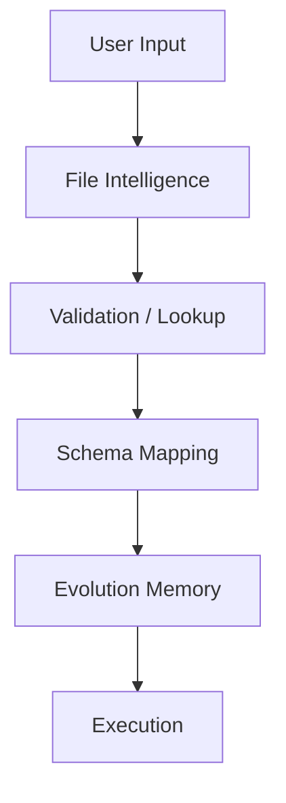

# Architecture: Genaja Learning Layer

Visualização do fluxo de inteligência evolutiva introduzido na v0.6.4.

## Camadas de Inteligência (v0.6.4)

1. **User Input**: Carregamento de arquivos CSV/Excel.
2. **File Intelligence**: Pré-análise de integridade e tipos.
3. **Validation / Lookup**: Auditoria de nulos e match exato de colunas.
4. **Schema Mapping**: Similaridade fuzzy (Levenshtein) para colunas desconhecidas.
5. **Evolution Memory**: Recuperação de mapeamentos históricos baseada em assinaturas de contexto.
6. **Execution**: Sincronização final e registro de novo aprendizado.
